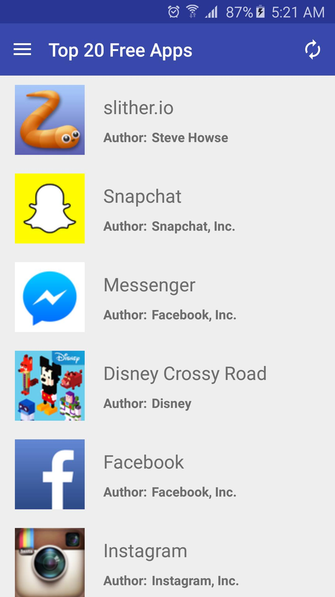
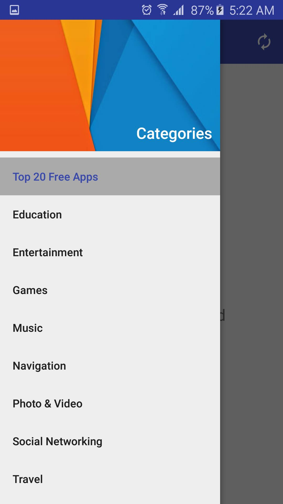
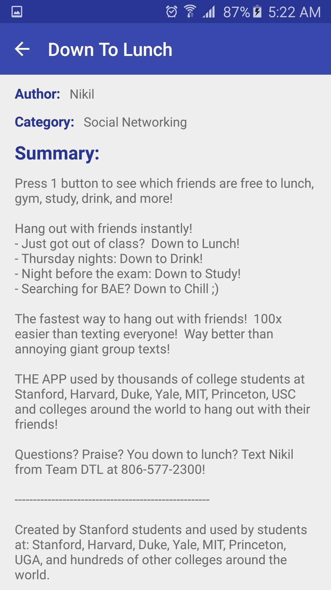
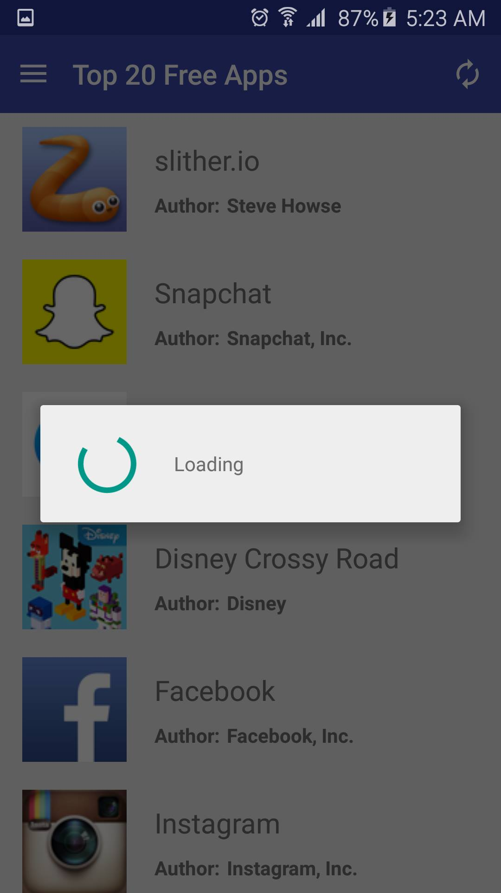
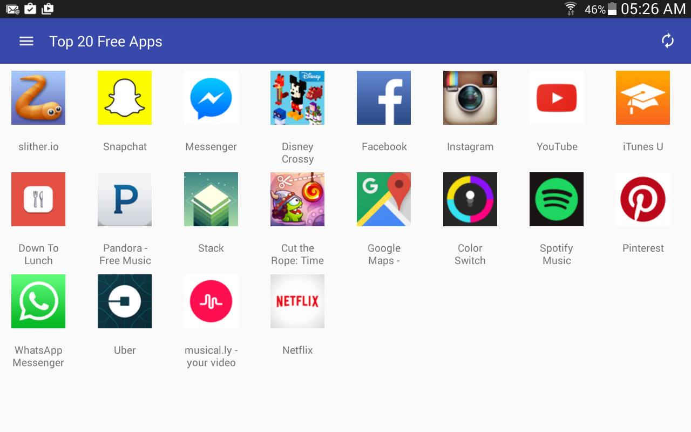
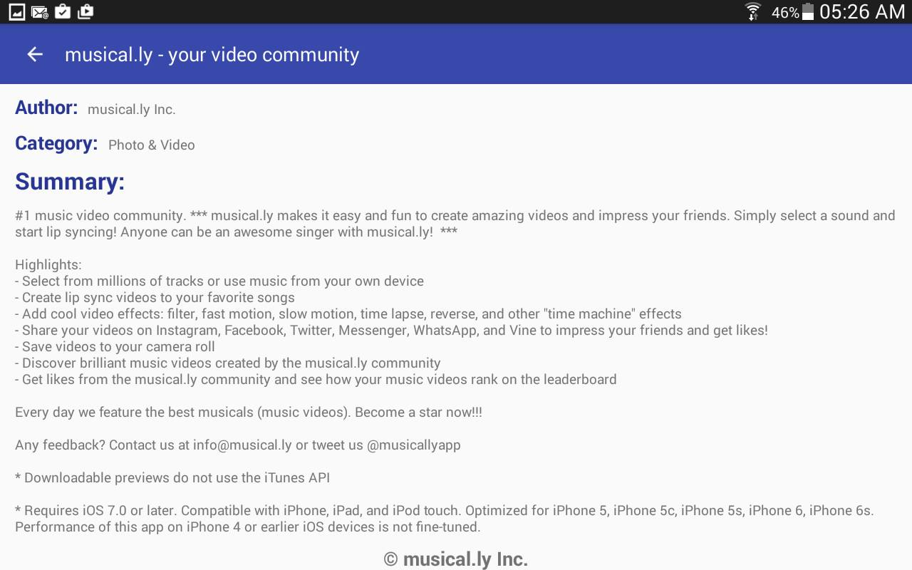
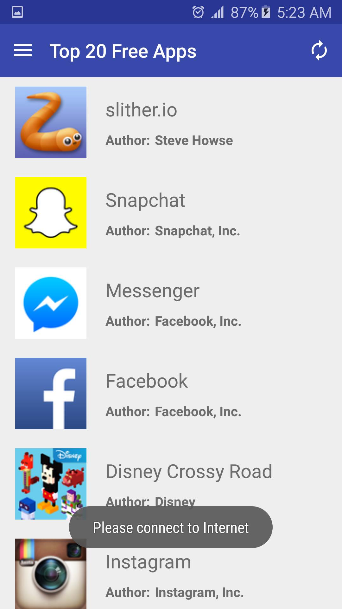

# Top Free AppStore Apps

An Android application that consumes an API from Appstore that shows the latest and most popular free apps at the moment.

The URL of the API comes from: https://itunes.apple.com/us/rss/topfreeapplications/limit=20/json

### Warning!, possible crash when installing from Android Studio 2.0.
I have found a compatibility problem between Instant Run from Android Studio 2.0 and SugarORM.
Basically, if you install the app and you have Instant Run activated you'll find a SQLiteException.
To solve this problem follow the next steps:
  1. Delete the app from the phone or emulator.
  2. In Android Studio go to _File - Settings - Build, Execution and Deployment - Instant Run_ and here uncheck _Enable Instant Run_.
  3. Run again the project in your phone.
This is the only way I've found to avoid this exception.

### How to use it

This application shows the 20 most popular free apps on AppStore.
First, you can see all 20 top apps.

You can use the NavigationView to select from different categories.

You can select an app to see more information about It.

If you want to get new information use the update button.

### Special features

This app supports different screen sizes.

Also, you don't have to worry about wasting your data because this app saves the information and you can check It even without an Internet connection.

### Frameworks used
1. SugarORM
2. Volley
